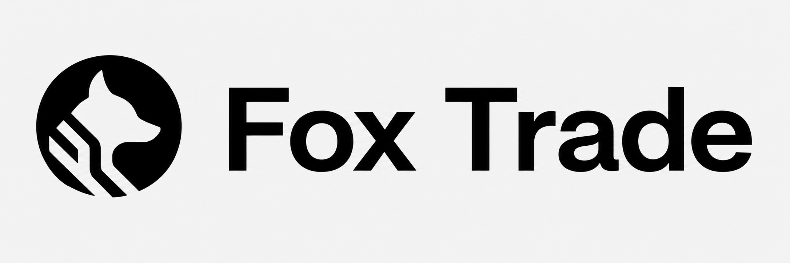

# FoxTrade 

  

FoxTrade is a real-time paper trading exchange simulator built to demonstrate backend correctness, exchange-style order matching, financial ledger modelling, real-time market updates, and production-grade system design.

The project focuses on building a backend-heavy trading platform with a custom matching engine, order book, wallet ledger, PostgreSQL persistence, Redis-powered event flow, and WebSocket-based live market updates.

---

## Live Link & Demo

Please find the live link of the project below:

In case the above link is not working, please find the demo of the application attached below:

---

## Tech Stack Used

### Frontend

- React
- TypeScript
- Vite
- Tailwind CSS
- WebSocket client for live order book, trades, and portfolio updates

### Backend

- Node.js
- TypeScript
- Express / Fastify REST API
- Zod for request validation
- JWT/session-based authentication

### Matching Engine

- Go
- Custom order book
- Price-time priority matching
- Limit orders
- Market orders
- Partial fills
- Full fills
- Cancel order support

### Database & Infrastructure

- PostgreSQL for durable trading data
- Prisma for database modelling and migrations
- Redis for cache, pub/sub, streams, and rate limiting
- Docker Compose for local infrastructure
- Turborepo monorepo setup

### Testing & Quality

- Matching engine unit tests
- Ledger and balance invariant tests
- API integration tests
- Benchmark results for matching latency and order throughput

---

## Core Features

### Trading Engine

- Custom matching engine
- Real-time order book
- Limit order support
- Market order support
- Price-time priority matching
- Partial fill and full fill handling
- Cancel open orders
- Trade generation after successful matches

### Financial Correctness

- Wallet ledger for every money and asset movement
- Available and reserved cash balances
- Available and reserved asset holdings
- Balance settlement after trades
- Reserved balance release after order cancellation
- Idempotency keys to prevent duplicate order execution
- Database transactions for order, trade, ledger, and balance updates

### Real-Time System

- Live order book updates through WebSockets
- Live trade feed through WebSockets
- User-specific order status updates
- User-specific portfolio updates
- Redis-backed event publishing
- Redis order book cache

### Production-Style Engineering

- Docker Compose local setup
- PostgreSQL persistence
- Redis cache/pubsub layer
- API validation
- Rate limiting
- Health check endpoints
- Tests for core backend correctness
- Benchmark results
- Architecture documentation
- ADRs for important engineering decisions

---

## Snapshots of the Application

<!-- Add application screenshots here after the UI is ready. -->

---

## Installation and Running the Application

### Prerequisites

- Node.js
- pnpm
- Go
- Docker
- Docker Compose

### Installation

- Option 1 : get the dockerized version of app, find the image link below. Pull the image into your machine and run `turbo run dev`.

- Option 2 : kindly clone the repository and run the commands in the root folder `npm install`, `turbo run dev`

## .env.example exists?

- yes, the .env.example exists to let the users know the environment variables being used in the project.

## Tests

- tests have been integrated, please follow the below instructions to check the tests :

## Architectural Design Record (ADR) :

## TradeOffs evaluation :

- Tradeoffs for the project.

## Limitations for the project :

- No limitations

